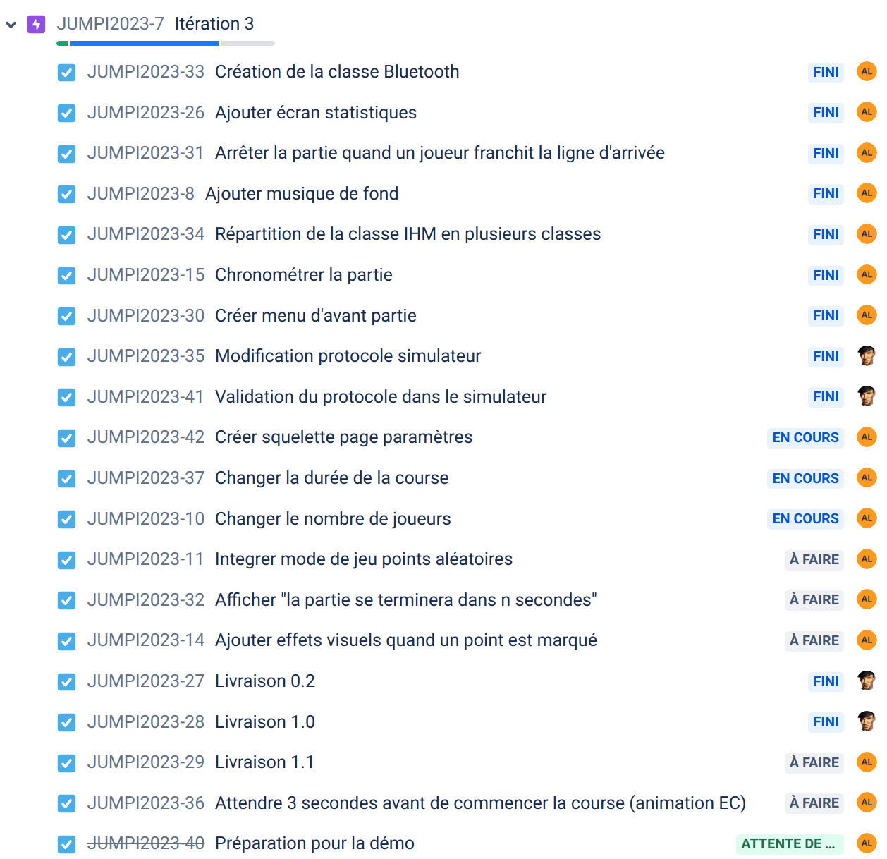

 

  

# Le projet jolly-jumpi 2023

- [Le projet jolly-jumpi 2023](#le-projet-jolly-jumpi-2023)
  - [Fonctionnalités](#fonctionnalit%C3%A9s)
  - [Documentation du code](#documentation-du-code)
  - [Présentations](#pr%C3%A9sentations)
  - [Vidéo](#vid%C3%A9o)
  - [Diagramme de classes](#diagramme-de-classes)
  - [Screenshots](#screenshots)
  - [Historique des versions](#historique-des-versions)
    - [1.0](#10)
    - [0.2](#02)
    - [0.1](#01)
  - [Auteur](#auteur)

---

Le système Jolly-JumPi est un système numérique permettant de jouer au tiercé de manière ludique : soyez le premier à faire franchir à votre jockey la ligne d’arrivée. Pour cela, envoyez vos balles dans les trous aux couleurs différentes. Cheval au pas, au trot ou au galop ?  A vous de viser le plus juste possible.

Le système est composé :

- d’un plateau équipé de capteurs permettant de détecter le passage d’une balle dans les trous. Chaque trou est équipé d’un cercle lumineux de couleur différente [Étudiant EC]
- d’une application sur Raspberry Pi et un écran de télévision pour suivre le déroulement de la partie [Étudiant IR]

## Fonctionnalités

- Android :

| Fonctionnalité   | OUI | NON |
| ------------------------- |:-----:|:-----:|
| Afficher un écran d’accueil | X |  |
| Gérer et afficher le déroulement de la course en temps réel | X |  |
| Afficher les données de la course et les statistiques | X |  |
| Dialoguer avec le module de détection | X |  |
| Configurer une course | X |  |

## Documentation du code

https://btssn-lasalle-84.github.io/jolly-jumpi-2023/

## Présentations

Diaporama étudiant IR :

- Axel LAPIERRE : [Revue finale - Lapierre.pptx](./diaporama/Revue%20finale%20-%20Lapierre.pptx)

## Vidéo

## Diagramme de classes

## Screenshots

## Historique des versions

### 1.0

### 0.2

### 0.1

## Auteur

- Étudiant IR : Axel LAPIERRE <lapierre.axel30@gmail.com>

---
©️ LaSalle Avignon 2023
